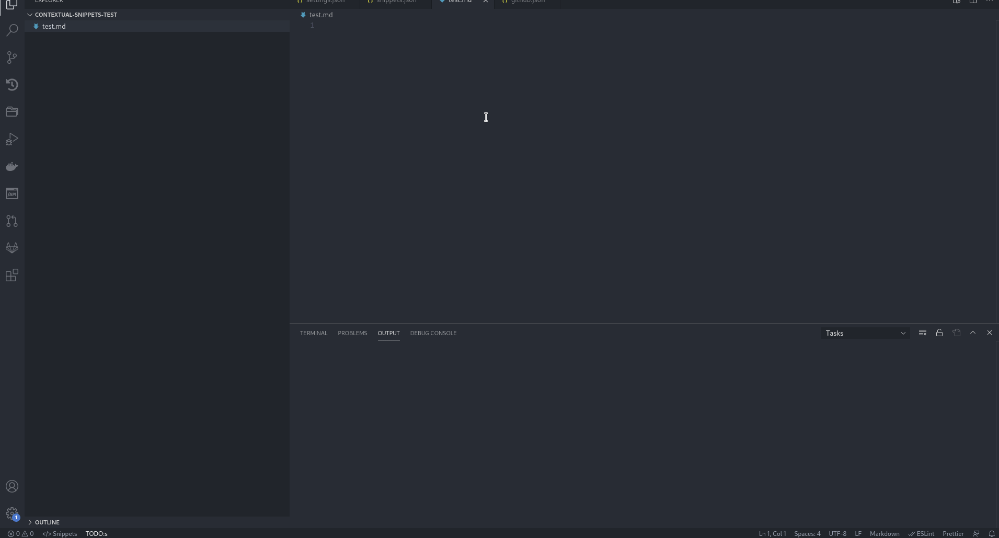

# VSCode SAO

> Trigger SAO js generators from VS Code

[](LICENSE)
[](https://github.com/brpaz/vscode-sao-extension/actions)

[](https://marketplace.visualstudio.com/items?itemName=brpaz.vscode-sao)

[](https://marketplace.visualstudio.com/items?itemName=brpaz.vscode-sao)

## Features

* Run SAO generator in the workspace root directory.
* Run SAO generator in a specific folder, from the context menu.



:information_source: You must have run a generator at least once from the command line, for it to appear on the extension.

## Requirements

This extension is only compatible with the lastest SAO v2, which is currently in Beta.

You can install it using: ```npm i -g sao@beta```

For more information, check [SAO](https://github.com/saojs/sao) on GitHub.

:warning: If you have used SAO v1 before, it is recommended to delete the "generators" section of `$HOME/.config/sao-nodejs/config.json` first to avoid old configurations.


## Contributing

Contributions are what make the open source community such an amazing place to be learn, inspire, and create. Any contributions you make are **greatly appreciated**.

1. Fork the Project
2. Create your Feature Branch (`git checkout -b feature/AmazingFeature`)
3. Commit your Changes (`git commit -m 'Add some AmazingFeature'`)
4. Push to the Branch (`git push origin feature/AmazingFeature`)
5. Open a Pull Request

## Author

👤 **Bruno Paz**

* Website: [brunopaz.dev](https://brunopaz.dev)
* Github: [@brpaz](https://github.com/brpaz)
* Twitter: [@brunopaz88](https://twitter.com/brunopaz88)


## 📝 License

Copyright © 2020 [Bruno Paz](https://github.com/brpaz).

This project is [MIT](https://opensource.org/licenses/MIT) licensed.
